# Modelo de Dados — ERP Malvezi MVP

Diagrama ER e referência completa de todas as tabelas dos 14 módulos.

> **Convenções:** tabelas `snake_case` singular · IDs `uuid` (UUID v7) · datas `data_*` · timestamps `criado_em / atualizado_em` · soft delete via campo `ativa` ou `status = 'cancelado'` · moeda `decimal(15,2)` · FK obrigatórias sem cascade delete.

---

## Diagrama ER

```mermaid
erDiagram

  %% ─────────────────────────────────────────────
  %% CORE — Usuários e Empresas
  %% ─────────────────────────────────────────────

  usuario {
    uuid   id PK
    string nome
    string email UK
    string senha_hash
    string foto_url
    bool   ativo
    bool   email_verificado
    bool   preferencia_multi_empresa
    json   empresas_selecionadas_multi
    ts     ultimo_login_em
    ts     criado_em
    ts     atualizado_em
  }

  empresa {
    uuid    id PK
    enum    tipo
    string  documento UK
    string  nome_principal
    string  nome_alternativo
    string  regime_tributario
    string  moeda_padrao
    string  cor_primaria
    string  logo_url
    bool    trava_fechamento_ativa
    int     dia_fechamento_mensal
    string  prefixo_lancamento
    bigint  proximo_numero_lancamento
    bool    ativa
    ts      criado_em
    ts      atualizado_em
  }

  usuario_empresa {
    uuid id PK
    uuid usuario_id FK
    uuid empresa_id FK
    ts   criado_em
  }

  token_seguranca {
    uuid   id PK
    uuid   usuario_id FK
    string token
    enum   tipo
    ts     expira_em
    ts     usado_em
    ts     criado_em
  }

  sessao {
    uuid   id PK
    uuid   usuario_id FK
    string token_hash
    bool   lembrar_me
    ts     expira_em
    string ip_origem
    ts     criado_em
    ts     encerrada_em
  }

  tentativa_login {
    uuid   id PK
    string email_tentado
    bool   sucesso
    string ip_origem
    ts     criado_em
  }

  %% ─────────────────────────────────────────────
  %% CADASTROS — Categorias e Contatos
  %% ─────────────────────────────────────────────

  categoria {
    uuid   id PK
    uuid   grupo_id FK
    uuid   empresa_id FK
    enum   natureza
    string nome
    enum   escopo
    bool   ativa
    int    ordem
    uuid   criado_por FK
    ts     criado_em
    ts     atualizado_em
  }

  contato {
    uuid   id PK
    uuid   empresa_id FK
    enum   tipo
    string documento
    string nome_principal
    string nome_alternativo
    bool   eh_cliente
    bool   eh_fornecedor
    enum   escopo
    uuid   categoria_padrao_id FK
    bool   ativa
    uuid   criado_por FK
    ts     criado_em
    ts     atualizado_em
  }

  banco_referencia {
    int    id PK
    string codigo_febraban UK
    string nome
    bool   ativo
  }

  %% ─────────────────────────────────────────────
  %% CONTAS BANCÁRIAS E CARTÕES
  %% ─────────────────────────────────────────────

  conta {
    uuid    id PK
    uuid    empresa_id FK
    string  nome
    enum    tipo
    int     banco_id FK
    string  agencia
    string  numero
    decimal saldo_inicial
    date    data_saldo_inicial
    string  bandeira
    int     dia_fechamento
    int     dia_vencimento
    uuid    conta_debito_automatico_id FK
    bool    conta_padrao
    bool    ativa
    uuid    criado_por FK
    ts      criado_em
    ts      atualizado_em
  }

  fatura_cartao {
    uuid    id PK
    uuid    cartao_id FK
    uuid    empresa_id FK
    date    periodo_inicio
    date    periodo_fim
    date    data_vencimento
    decimal valor_total
    decimal valor_pago
    enum    status
    ts      data_pagamento
    uuid    lancamento_pagamento_id FK
    ts      criado_em
    ts      atualizado_em
  }

  %% ─────────────────────────────────────────────
  %% LANÇAMENTOS — Núcleo Financeiro
  %% ─────────────────────────────────────────────

  recorrencia {
    uuid id PK
    uuid lancamento_modelo_id FK
    enum frequencia
    int  dia_referencia
    date data_inicio
    date data_fim
    bool ativa
    ts   criado_em
    ts   atualizado_em
  }

  lancamento {
    uuid    id PK
    uuid    empresa_id FK
    string  numero
    enum    tipo_lancamento
    enum    natureza
    string  descricao
    decimal valor
    date    data_vencimento
    date    data_competencia
    uuid    categoria_id FK
    uuid    conta_id FK
    uuid    contato_id FK
    string  forma_pagamento
    uuid    lancamento_mae_id FK
    int     parcela_atual
    int     parcela_total
    uuid    recorrencia_id FK
    uuid    fatura_id FK
    uuid    transferencia_id FK
    enum    status
    date    data_pagamento
    decimal valor_pago
    decimal juros
    decimal multa
    decimal desconto
    string  numero_documento
    uuid    criado_por FK
    ts      criado_em
    ts      atualizado_em
  }

  pagamento {
    uuid    id PK
    uuid    lancamento_id FK
    date    data
    decimal valor
    decimal juros
    decimal multa
    decimal desconto
    uuid    conta_id FK
    uuid    criado_por FK
    ts      criado_em
  }

  anexo_lancamento {
    uuid   id PK
    uuid   lancamento_id FK
    string nome_arquivo
    string tipo_mime
    bigint tamanho_bytes
    string url_storage
    uuid   criado_por FK
    ts     criado_em
  }

  transferencia {
    uuid    id PK
    uuid    empresa_origem_id FK
    uuid    empresa_destino_id FK
    uuid    conta_origem_id FK
    uuid    conta_destino_id FK
    date    data
    decimal valor
    decimal tarifa_bancaria
    string  descricao
    enum    status
    uuid    criado_por FK
    ts      criado_em
    ts      atualizado_em
  }

  %% ─────────────────────────────────────────────
  %% CONCILIAÇÃO BANCÁRIA
  %% ─────────────────────────────────────────────

  importacao_extrato {
    uuid   id PK
    uuid   empresa_id FK
    uuid   conta_id FK
    enum   formato
    string arquivo_storage_url
    string arquivo_hash
    date   periodo_inicio
    date   periodo_fim
    int    total_linhas
    int    linhas_conciliadas
    enum   status
    uuid   criado_por FK
    ts     criado_em
  }

  linha_extrato {
    uuid    id PK
    uuid    importacao_id FK
    date    data
    string  descricao_original
    decimal valor
    enum    tipo
    string  fitid
    enum    status
    uuid    lancamento_id FK
    uuid    transferencia_id FK
    ts      criado_em
  }

  regra_conciliacao_aprendida {
    uuid   id PK
    uuid   empresa_id FK
    uuid   conta_id FK
    string padrao_descricao
    uuid   categoria_sugerida_id FK
    uuid   contato_sugerido_id FK
    int    vezes_aplicada
    ts     ultima_aplicacao
    ts     criado_em
  }

  mapeamento_csv_template {
    uuid   id PK
    uuid   usuario_id FK
    int    banco_id FK
    string nome_template
    int    coluna_data
    int    coluna_descricao
    int    coluna_valor
    string formato_data
    ts     criado_em
  }

  %% ─────────────────────────────────────────────
  %% PERMISSÕES
  %% ─────────────────────────────────────────────

  menu {
    uuid   id PK
    string codigo UK
    string nome_exibicao
    int    ordem
    uuid   menu_pai_id FK
    string icone
  }

  permissao_acao {
    uuid   id PK
    string codigo UK
    string nome_exibicao
  }

  menu_acao_disponivel {
    uuid id PK
    uuid menu_id FK
    uuid permissao_acao_id FK
  }

  usuario_permissao {
    uuid id PK
    uuid usuario_id FK
    uuid menu_id FK
    uuid permissao_acao_id FK
    bool concedida
    uuid criado_por FK
    ts   criado_em
  }

  %% ─────────────────────────────────────────────
  %% AUDITORIA
  %% ─────────────────────────────────────────────

  log_auditoria {
    uuid   id PK
    uuid   usuario_id FK
    string tabela_afetada
    string registro_id
    enum   operacao
    jsonb  dados_anteriores
    jsonb  dados_novos
    string ip_origem
    ts     criado_em
  }

  %% ─────────────────────────────────────────────
  %% RELACIONAMENTOS
  %% ─────────────────────────────────────────────

  usuario ||--o{ usuario_empresa       : "acessa"
  empresa ||--o{ usuario_empresa       : "pertence a"

  usuario ||--o{ token_seguranca       : "possui"
  usuario ||--o{ sessao                : "abre"

  usuario ||--o{ categoria             : "criou"
  usuario ||--o{ contato               : "criou"
  usuario ||--o{ conta                 : "criou"
  usuario ||--o{ lancamento            : "criou"
  usuario ||--o{ pagamento             : "registrou"
  usuario ||--o{ transferencia         : "criou"
  usuario ||--o{ importacao_extrato    : "importou"
  usuario ||--o{ log_auditoria         : "gerou"
  usuario ||--o{ usuario_permissao     : "tem"
  usuario ||--o{ mapeamento_csv_template : "salvou"

  empresa ||--o{ conta                 : "tem"
  empresa ||--o{ lancamento            : "possui"
  empresa ||--o{ transferencia         : "originou"
  empresa ||--o{ importacao_extrato    : "importou"
  empresa ||--o{ regra_conciliacao_aprendida : "aprende"

  categoria ||--o{ categoria           : "agrupa (hierarquia)"
  categoria ||--o{ lancamento          : "classifica"
  categoria ||--o{ contato             : "padrão de"
  categoria ||--o{ regra_conciliacao_aprendida : "sugerida em"

  contato ||--o{ lancamento            : "envolvido em"
  contato ||--o{ regra_conciliacao_aprendida : "sugerido em"

  banco_referencia ||--o{ conta        : "referencia"
  banco_referencia ||--o{ mapeamento_csv_template : "base para"

  conta ||--o{ lancamento              : "movimenta"
  conta ||--o{ fatura_cartao           : "gera"
  conta ||--o{ transferencia           : "origem"
  conta ||--o{ transferencia           : "destino"
  conta ||--o{ pagamento               : "debitada em"
  conta ||--o{ importacao_extrato      : "conciliada em"
  conta ||--o{ regra_conciliacao_aprendida : "contexto de"
  conta ||--o| conta                   : "débito automático"

  fatura_cartao ||--o{ lancamento      : "agrega compras"
  fatura_cartao |o--o| lancamento      : "paga por"

  recorrencia ||--o{ lancamento        : "gera"
  recorrencia |o--|| lancamento        : "modelo"

  lancamento ||--o{ lancamento         : "parcelas (mãe)"
  lancamento ||--o{ pagamento          : "tem baixas"
  lancamento ||--o{ anexo_lancamento   : "tem anexos"
  lancamento |o--o{ linha_extrato      : "conciliada em"

  transferencia ||--o{ lancamento      : "gera dois lançamentos"
  transferencia ||--o{ linha_extrato   : "identificada em"

  importacao_extrato ||--o{ linha_extrato : "contém"

  menu ||--o{ menu                     : "submenu"
  menu ||--o{ menu_acao_disponivel     : "disponibiliza"
  menu ||--o{ usuario_permissao        : "controla acesso"

  permissao_acao ||--o{ menu_acao_disponivel : "disponível em"
  permissao_acao ||--o{ usuario_permissao    : "concedida via"
```



---

## Referência de Tabelas

### `usuario`

| Campo | Tipo | Notas |
|---|---|---|
| `id` | uuid PK | UUID v7 |
| `nome` | varchar(200) | |
| `email` | varchar(320) UK | case-insensitive (citext) |
| `senha_hash` | varchar(255) | bcrypt |
| `foto_url` | varchar | Storage URL |
| `ativo` | bool | soft delete |
| `email_verificado` | bool | |
| `preferencia_multi_empresa` | bool | default false |
| `empresas_selecionadas_multi` | uuid[] | empresas no modo simultâneo |
| `ultimo_login_em` | timestamptz | |
| `criado_em` | timestamptz | |
| `atualizado_em` | timestamptz | |

---

### `empresa`

| Campo | Tipo | Notas |
|---|---|---|
| `id` | uuid PK | |
| `tipo` | enum(PJ,PF) | imutável após 1º lançamento |
| `documento` | varchar(18) UK | CNPJ ou CPF validado |
| `nome_principal` | varchar(200) | Razão Social / Nome |
| `nome_alternativo` | varchar(200) | Fantasia / Apelido |
| `regime_tributario` | enum | só PJ: Simples, Presumido, Real, MEI |
| `moeda_padrao` | char(3) | ISO 4217, default 'BRL' |
| `simbolo_monetario` | varchar(5) | default 'R$' |
| `separador_decimal` | char(1) | default ',' |
| `separador_milhares` | char(1) | default '.' |
| `casas_decimais_valor` | smallint | default 2 |
| `mes_inicio_exercicio` | smallint | 1–12, default 1 |
| `trava_fechamento_ativa` | bool | default false |
| `dia_fechamento_mensal` | smallint | 1–28, default 5 |
| `prefixo_lancamento` | varchar(10) | ex: 'LCT-' |
| `proximo_numero_lancamento` | bigint | sequencial atômico |
| `reset_anual_numeracao` | bool | default false |
| `data_inicio_uso` | date | |
| `cor_primaria` | varchar(7) | HEX |
| `logo_url` | varchar | Storage URL, máx 2 MB |
| `endereco_cep` | varchar(9) | |
| `logradouro` | varchar(200) | |
| `numero` | varchar(10) | |
| `complemento` | varchar(100) | |
| `bairro` | varchar(100) | |
| `cidade` | varchar(100) | |
| `uf` | char(2) | |
| `pais` | varchar(50) | default 'Brasil' |
| `telefone` | varchar(20) | |
| `email` | varchar(320) | |
| `ativa` | bool | soft delete |
| `criado_em` | timestamptz | |
| `atualizado_em` | timestamptz | |

---

### `usuario_empresa`

| Campo | Tipo | Notas |
|---|---|---|
| `id` | uuid PK | |
| `usuario_id` | uuid FK | → usuario |
| `empresa_id` | uuid FK | → empresa |
| `criado_em` | timestamptz | |

**Constraint:** UNIQUE(usuario_id, empresa_id)

---

### `token_seguranca`

| Campo | Tipo | Notas |
|---|---|---|
| `id` | uuid PK | |
| `usuario_id` | uuid FK | |
| `token` | varchar | SHA-256 hash |
| `tipo` | enum | resetar_senha, definir_senha, email_verificacao |
| `expira_em` | timestamptz | +30 min da criação |
| `usado_em` | timestamptz | NULL até uso |
| `criado_em` | timestamptz | |

---

### `sessao`

| Campo | Tipo | Notas |
|---|---|---|
| `id` | uuid PK | |
| `usuario_id` | uuid FK | |
| `token_hash` | varchar | SHA-256 |
| `lembrar_me` | bool | duração 8h vs 30d |
| `expira_em` | timestamptz | |
| `ip_origem` | varchar(45) | IPv4/IPv6 |
| `user_agent` | text | |
| `criado_em` | timestamptz | |
| `encerrada_em` | timestamptz | NULL enquanto ativa |

---

### `tentativa_login`

| Campo | Tipo | Notas |
|---|---|---|
| `id` | uuid PK | |
| `email_tentado` | varchar | |
| `sucesso` | bool | |
| `ip_origem` | varchar(45) | |
| `user_agent` | text | |
| `criado_em` | timestamptz | |

---

### `categoria`

| Campo | Tipo | Notas |
|---|---|---|
| `id` | uuid PK | |
| `grupo_id` | uuid FK | → categoria (auto-ref, NULL = raiz) |
| `empresa_id` | uuid FK | → empresa; NULL quando escopo=global |
| `natureza` | enum(receita,despesa) | |
| `nome` | varchar(100) | único dentro do grupo |
| `descricao` | text | |
| `cor` | varchar(7) | HEX |
| `icone` | varchar(50) | |
| `escopo` | enum(global,especifico) | default global |
| `ordem` | smallint | |
| `ativa` | bool | soft delete |
| `criado_por` | uuid FK | → usuario |
| `criado_em` | timestamptz | |
| `atualizado_em` | timestamptz | |

**Regra:** hierarquia máxima de 3 níveis (natureza → grupo → categoria).
**Constraint:** UNIQUE(grupo_id, nome, empresa_id)

---

### `contato`

| Campo | Tipo | Notas |
|---|---|---|
| `id` | uuid PK | |
| `empresa_id` | uuid FK | → empresa; NULL quando escopo=global |
| `tipo` | enum(PJ,PF) | |
| `documento` | varchar(18) | CNPJ ou CPF |
| `nome_principal` | varchar(200) | |
| `nome_alternativo` | varchar(200) | |
| `documento_complementar_1` | varchar(30) | IE ou RG |
| `contribuinte_icms` | varchar(1) | só PJ |
| `email` | varchar(320) | |
| `telefone_principal` | varchar(20) | |
| `telefone_secundario` | varchar(20) | |
| `endereco_cep` | varchar(9) | |
| `logradouro` | varchar(200) | |
| `numero` | varchar(10) | |
| `complemento` | varchar(100) | |
| `bairro` | varchar(100) | |
| `cidade` | varchar(100) | |
| `uf` | char(2) | |
| `pais` | varchar(50) | |
| `foto_url` | varchar | Storage URL |
| `observacoes` | text | |
| `eh_cliente` | bool | CHECK: eh_cliente OR eh_fornecedor |
| `eh_fornecedor` | bool | |
| `categoria_padrao_id` | uuid FK | → categoria |
| `forma_pagamento_padrao` | varchar(30) | |
| `escopo` | enum(global,especifico) | default global |
| `ativa` | bool | soft delete |
| `criado_por` | uuid FK | → usuario |
| `criado_em` | timestamptz | |
| `atualizado_em` | timestamptz | |

**Constraint:** UNIQUE(documento, escopo, empresa_id); CHECK(eh_cliente OR eh_fornecedor)

---

### `banco_referencia`

| Campo | Tipo | Notas |
|---|---|---|
| `id` | serial PK | |
| `codigo_febraban` | varchar(10) UK | |
| `nome` | varchar(100) | |
| `ativo` | bool | |

---

### `conta`

| Campo | Tipo | Notas |
|---|---|---|
| `id` | uuid PK | |
| `empresa_id` | uuid FK | obrigatório |
| `nome` | varchar(100) | |
| `tipo` | enum | corrente, poupanca, caixinha, aplicacao, cartao_credito, outros |
| `banco_id` | int FK | → banco_referencia |
| `banco_outro` | varchar(100) | campo livre |
| `agencia` | varchar(10) | obrigatório para corrente/poupança |
| `agencia_digito` | varchar(2) | |
| `numero` | varchar(20) | obrigatório para corrente/poupança |
| `numero_digito` | varchar(2) | |
| `tipo_operacao` | varchar(5) | |
| `titular` | varchar(200) | |
| `saldo_inicial` | decimal(15,2) | |
| `data_saldo_inicial` | date | |
| `bandeira` | varchar(20) | obrigatório para cartão |
| `ultimos_4_digitos` | char(4) | |
| `limite` | decimal(15,2) | cartão |
| `dia_fechamento` | smallint | obrigatório para cartão (1–31) |
| `dia_vencimento` | smallint | obrigatório para cartão (1–31) |
| `conta_debito_automatico_id` | uuid FK | → conta (auto-ref) |
| `cor` | varchar(7) | HEX |
| `icone` | varchar(50) | |
| `conta_padrao` | bool | apenas uma por empresa |
| `observacoes` | text | |
| `ativa` | bool | soft delete |
| `criado_por` | uuid FK | → usuario |
| `criado_em` | timestamptz | |
| `atualizado_em` | timestamptz | |

---

### `fatura_cartao`

| Campo | Tipo | Notas |
|---|---|---|
| `id` | uuid PK | |
| `cartao_id` | uuid FK | → conta (tipo=cartao_credito) |
| `empresa_id` | uuid FK | denormalização para query |
| `periodo_inicio` | date | |
| `periodo_fim` | date | |
| `data_vencimento` | date | |
| `valor_total` | decimal(15,2) | SUM das compras |
| `valor_pago` | decimal(15,2) | default 0 |
| `status` | enum | aberta, fechada, parcialmente_paga, paga, em_atraso |
| `data_pagamento` | timestamptz | NULL até ser paga |
| `lancamento_pagamento_id` | uuid FK | → lancamento |
| `criado_em` | timestamptz | |
| `atualizado_em` | timestamptz | |

---

### `recorrencia`

| Campo | Tipo | Notas |
|---|---|---|
| `id` | uuid PK | |
| `lancamento_modelo_id` | uuid FK | → lancamento (template) |
| `frequencia` | enum | diaria, semanal, mensal, trimestral, semestral, anual |
| `dia_referencia` | smallint | dia do mês / dia da semana |
| `data_inicio` | date | |
| `data_fim` | date | NULL = sem fim |
| `ativa` | bool | soft delete |
| `criado_em` | timestamptz | |
| `atualizado_em` | timestamptz | |

---

### `lancamento`

| Campo | Tipo | Notas |
|---|---|---|
| `id` | uuid PK | UUID v7 |
| `empresa_id` | uuid FK | obrigatório |
| `numero` | varchar(30) | UNIQUE por empresa, gerado atomicamente |
| `tipo_lancamento` | enum | receita, despesa, transferencia, compra_cartao, pagamento_fatura, estorno_cartao |
| `natureza` | enum(receita,despesa) | denormalização |
| `descricao` | varchar(300) | |
| `valor` | decimal(15,2) | > 0 |
| `data_vencimento` | date | |
| `data_competencia` | date | = data_vencimento no MVP (regime de caixa) |
| `categoria_id` | uuid FK | → categoria; obrigatório exceto transferência |
| `conta_id` | uuid FK | → conta; obrigatório |
| `contato_id` | uuid FK | → contato; obrigatório para receita/despesa |
| `forma_pagamento` | varchar(30) | boleto, cartao, dinheiro, deposito, transferencia |
| `lancamento_mae_id` | uuid FK | → lancamento (auto-ref, parcelas) |
| `parcela_atual` | smallint | ex: 1 |
| `parcela_total` | smallint | ex: 12 |
| `recorrencia_id` | uuid FK | → recorrencia |
| `fatura_id` | uuid FK | → fatura_cartao |
| `transferencia_id` | uuid FK | → transferencia |
| `status` | enum | previsto, pago, recebido, parcial, atrasado, cancelado |
| `data_pagamento` | date | NULL enquanto previsto |
| `valor_pago` | decimal(15,2) | |
| `juros` | decimal(15,2) | |
| `multa` | decimal(15,2) | |
| `desconto` | decimal(15,2) | |
| `numero_documento` | varchar(60) | NF, boleto etc. |
| `observacoes` | text | |
| `tags` | text[] | |
| `criado_por` | uuid FK | → usuario |
| `criado_em` | timestamptz | |
| `atualizado_em` | timestamptz | |

**Constraint:** UNIQUE(empresa_id, numero)

---

### `pagamento`

| Campo | Tipo | Notas |
|---|---|---|
| `id` | uuid PK | |
| `lancamento_id` | uuid FK | |
| `data` | date | |
| `valor` | decimal(15,2) | |
| `juros` | decimal(15,2) | |
| `multa` | decimal(15,2) | |
| `desconto` | decimal(15,2) | |
| `conta_id` | uuid FK | conta de onde saiu/entrou |
| `observacoes` | text | |
| `criado_por` | uuid FK | → usuario |
| `criado_em` | timestamptz | |

---

### `anexo_lancamento`

| Campo | Tipo | Notas |
|---|---|---|
| `id` | uuid PK | |
| `lancamento_id` | uuid FK | |
| `nome_arquivo` | varchar(255) | |
| `tipo_mime` | varchar(100) | |
| `tamanho_bytes` | bigint | máx 10 MB |
| `url_storage` | varchar | URL assinada |
| `criado_por` | uuid FK | → usuario |
| `criado_em` | timestamptz | |

**Constraint:** CHECK(COUNT por lancamento_id ≤ 10) — enforced na camada de serviço.

---

### `transferencia`

| Campo | Tipo | Notas |
|---|---|---|
| `id` | uuid PK | |
| `empresa_origem_id` | uuid FK | → empresa |
| `empresa_destino_id` | uuid FK | → empresa |
| `conta_origem_id` | uuid FK | → conta |
| `conta_destino_id` | uuid FK | → conta |
| `data` | date | |
| `valor` | decimal(15,2) | > 0 |
| `tarifa_bancaria` | decimal(15,2) | gera lançamento separado |
| `descricao` | varchar(300) | |
| `observacoes` | text | |
| `status` | enum(efetivada,cancelada) | |
| `criado_por` | uuid FK | → usuario |
| `criado_em` | timestamptz | |
| `atualizado_em` | timestamptz | |

**Constraint:** conta_origem_id ≠ conta_destino_id; conta_origem pertence a empresa_origem.

---

### `importacao_extrato`

| Campo | Tipo | Notas |
|---|---|---|
| `id` | uuid PK | |
| `empresa_id` | uuid FK | |
| `conta_id` | uuid FK | |
| `formato` | enum(OFX,CSV,EXCEL) | |
| `arquivo_storage_url` | varchar | |
| `arquivo_hash` | char(64) | SHA-256 (detecção de reimportação) |
| `periodo_inicio` | date | |
| `periodo_fim` | date | |
| `total_linhas` | int | |
| `linhas_conciliadas` | int | |
| `linhas_ignoradas` | int | |
| `status` | enum(pendente,concluido,erro) | |
| `criado_por` | uuid FK | → usuario |
| `criado_em` | timestamptz | |

---

### `linha_extrato`

| Campo | Tipo | Notas |
|---|---|---|
| `id` | uuid PK | |
| `importacao_id` | uuid FK | |
| `data` | date | |
| `descricao_original` | varchar(300) | |
| `valor` | decimal(15,2) | |
| `tipo` | enum(entrada,saida) | |
| `fitid` | varchar(255) | ID único OFX; NULL para CSV |
| `status` | enum | pendente, conciliada, ignorada, duplicada |
| `lancamento_id` | uuid FK | → lancamento; preenchido após conciliação |
| `transferencia_id` | uuid FK | → transferencia; se identificada |
| `motivo_ignorada` | varchar(200) | |
| `criado_em` | timestamptz | |

---

### `regra_conciliacao_aprendida`

| Campo | Tipo | Notas |
|---|---|---|
| `id` | uuid PK | |
| `empresa_id` | uuid FK | |
| `conta_id` | uuid FK | |
| `padrao_descricao` | varchar(300) | substring ou regex |
| `categoria_sugerida_id` | uuid FK | → categoria |
| `contato_sugerido_id` | uuid FK | → contato |
| `vezes_aplicada` | int | default 0 |
| `ultima_aplicacao` | timestamptz | |
| `criado_em` | timestamptz | |

---

### `mapeamento_csv_template`

| Campo | Tipo | Notas |
|---|---|---|
| `id` | uuid PK | |
| `usuario_id` | uuid FK | |
| `banco_id` | int FK | → banco_referencia |
| `nome_template` | varchar(100) | |
| `coluna_data` | smallint | índice 0-based |
| `coluna_descricao` | smallint | |
| `coluna_valor` | smallint | |
| `coluna_tipo` | smallint | NULL se não houver |
| `coluna_documento` | smallint | NULL se não houver |
| `separador_decimal` | char(1) | |
| `formato_data` | varchar(20) | ex: 'DD/MM/YYYY' |
| `criado_em` | timestamptz | |

---

### `menu`

| Campo | Tipo | Notas |
|---|---|---|
| `id` | uuid PK | |
| `codigo` | varchar(50) UK | ex: 'lancamentos.receitas' |
| `nome_exibicao` | varchar(100) | PT-BR |
| `ordem` | smallint | |
| `menu_pai_id` | uuid FK | → menu (auto-ref) |
| `icone` | varchar(50) | |

---

### `permissao_acao`

| Campo | Tipo | Notas |
|---|---|---|
| `id` | uuid PK | |
| `codigo` | varchar(50) UK | visualizar, criar, editar, excluir, exportar, executar, conceder_permissoes |
| `nome_exibicao` | varchar(100) | PT-BR |

---

### `menu_acao_disponivel`

| Campo | Tipo | Notas |
|---|---|---|
| `id` | uuid PK | |
| `menu_id` | uuid FK | |
| `permissao_acao_id` | uuid FK | |

**Constraint:** UNIQUE(menu_id, permissao_acao_id)

---

### `usuario_permissao`

| Campo | Tipo | Notas |
|---|---|---|
| `id` | uuid PK | |
| `usuario_id` | uuid FK | |
| `menu_id` | uuid FK | |
| `permissao_acao_id` | uuid FK | |
| `concedida` | bool | true = permitido |
| `criado_por` | uuid FK | → usuario (quem concedeu) |
| `criado_em` | timestamptz | |

**Constraint:** UNIQUE(usuario_id, menu_id, permissao_acao_id)
**Regra:** Novo usuário sem nenhuma tupla = sem nenhum acesso.

---

### `log_auditoria`

| Campo | Tipo | Notas |
|---|---|---|
| `id` | uuid PK | UUID v7 |
| `usuario_id` | uuid FK | quem fez a operação |
| `tabela_afetada` | varchar(60) | ex: 'lancamento' |
| `registro_id` | varchar(36) | UUID do registro afetado |
| `operacao` | enum(INSERT,UPDATE,DELETE) | |
| `dados_anteriores` | jsonb | NULL em INSERT |
| `dados_novos` | jsonb | NULL em DELETE |
| `ip_origem` | varchar(45) | |
| `criado_em` | timestamptz | |

---

## Enumerações

| Enum | Valores |
|---|---|
| `tipo_pessoa` | PJ, PF |
| `escopo` | global, especifico |
| `natureza` | receita, despesa |
| `tipo_lancamento` | receita, despesa, transferencia, compra_cartao, pagamento_fatura, estorno_cartao |
| `status_lancamento` | previsto, pago, recebido, parcial, atrasado, cancelado |
| `tipo_conta` | corrente, poupanca, caixinha, aplicacao, cartao_credito, outros |
| `status_fatura` | aberta, fechada, parcialmente_paga, paga, em_atraso |
| `status_transferencia` | efetivada, cancelada |
| `frequencia_recorrencia` | diaria, semanal, mensal, trimestral, semestral, anual |
| `tipo_token` | resetar_senha, definir_senha, email_verificacao |
| `regime_tributario` | Simples, Presumido, Real, MEI |
| `formato_extrato` | OFX, CSV, EXCEL |
| `status_importacao` | pendente, concluido, erro |
| `status_linha_extrato` | pendente, conciliada, ignorada, duplicada |
| `tipo_linha_extrato` | entrada, saida |
| `operacao_auditoria` | INSERT, UPDATE, DELETE |

---

## Índices Críticos

```sql
-- Lançamentos (queries mais frequentes)
CREATE INDEX idx_lancamento_empresa_vencimento   ON lancamento(empresa_id, data_vencimento);
CREATE INDEX idx_lancamento_empresa_status       ON lancamento(empresa_id, status);
CREATE INDEX idx_lancamento_conta               ON lancamento(conta_id);
CREATE INDEX idx_lancamento_categoria           ON lancamento(categoria_id);
CREATE INDEX idx_lancamento_contato             ON lancamento(contato_id);
CREATE INDEX idx_lancamento_fatura              ON lancamento(fatura_id);
CREATE INDEX idx_lancamento_mae                 ON lancamento(lancamento_mae_id);
CREATE INDEX idx_lancamento_recorrencia         ON lancamento(recorrencia_id);
UNIQUE INDEX  idx_lancamento_numero_empresa      ON lancamento(empresa_id, numero);

-- Fatura
CREATE INDEX idx_fatura_cartao_status           ON fatura_cartao(status);
CREATE INDEX idx_fatura_empresa_vencimento      ON fatura_cartao(empresa_id, data_vencimento);

-- Conciliação
CREATE INDEX idx_linha_extrato_fitid            ON linha_extrato(fitid) WHERE fitid IS NOT NULL;
CREATE INDEX idx_linha_extrato_importacao       ON linha_extrato(importacao_id);
CREATE INDEX idx_linha_extrato_status           ON linha_extrato(status);

-- Auditoria
CREATE INDEX idx_log_tabela_registro            ON log_auditoria(tabela_afetada, registro_id);
CREATE INDEX idx_log_criado_em                  ON log_auditoria(criado_em DESC);

-- Permissões
UNIQUE INDEX idx_usuario_permissao_uk           ON usuario_permissao(usuario_id, menu_id, permissao_acao_id);
```

---

## Regras de Negócio Transversais (impacto no schema)

| Regra | Tabelas impactadas |
|---|---|
| Soft delete: nunca apagar registros com histórico | `empresa.ativa`, `conta.ativa`, `categoria.ativa`, `contato.ativa`, `usuario.ativo`, `lancamento.status='cancelado'` |
| Multi-empresa: toda entidade financeira tem `empresa_id` | `conta`, `lancamento`, `transferencia`, `fatura_cartao`, `importacao_extrato` |
| Cadastro global vs específico: `empresa_id NULL` = global | `categoria.empresa_id`, `contato.empresa_id` |
| Auditoria: toda alteração crítica gera `log_auditoria` | `log_auditoria` + triggers nas tabelas financeiras |
| Trava de fechamento: `data_competencia ≤ dia_fechamento_mensal` bloqueia edições | `empresa.trava_fechamento_ativa`, `lancamento.data_competencia` |
| Cartão: compra ≠ saída de caixa; fatura = saída de caixa | `fatura_cartao`, `lancamento.fatura_id`, `lancamento.tipo_lancamento` |
| Parcelamento: 1 mãe + N filhas via `lancamento_mae_id` | `lancamento.lancamento_mae_id`, `parcela_atual`, `parcela_total` |
| Permissão zerada por padrão: novo usuário sem acesso | `usuario_permissao` (ausência de tuplas = sem acesso) |
| Numeração sequencial atômica por empresa | `empresa.proximo_numero_lancamento`, `lancamento.numero` |
| UUID v7 em todas as PKs (ordenável temporalmente) | todos os IDs |
| `decimal(15,2)` em todos os valores monetários | `lancamento.valor`, `pagamento.valor`, `conta.saldo_inicial` etc. |
